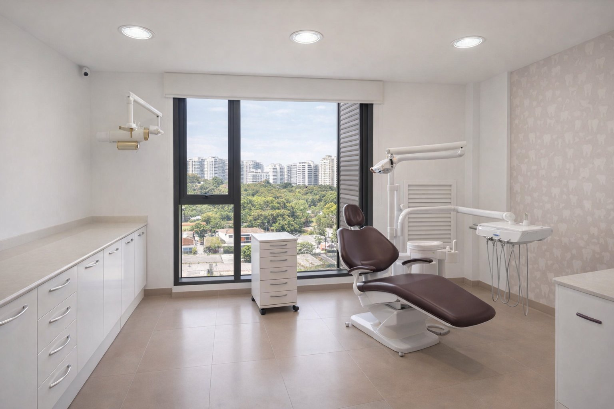

# Clínica Odontológica Dra. Flavia Pousa — site institucional

Site institucional em HTML/CSS/JS puro (sem build step, sem framework). Pronto para
subir em qualquer hospedagem estática, incluindo a Hostinger.

## Estrutura

```
index.html          página única (todas as seções, âncoras internas)
css/
  tokens.css         variáveis de design (cores, tipografia, espaçamento, sombras)
  styles.css         estilos de layout e componentes
js/
  main.js            menu mobile, link ativo no scroll, animação de entrada
assets/
  logo-*.png         logos (horizontal, vertical, símbolo, símbolo mono)
  fotos/             fotos reais da clínica (consultório, equipe, estrutura)
robots.txt
sitemap.xml
_original-claude-export/   arquivos originais gerados no Claude (não fazem parte do
                            site publicado — mantidos como referência de marca/histórico)
```

## Rodando localmente

Não precisa de `npm install` nem de servidor Node. Qualquer servidor estático serve
os arquivos como estão. Exemplos:

```bash
python -m http.server 8090
```

Depois abra `http://localhost:8090`. (Abrir o `index.html` direto com duplo clique
também funciona, mas alguns navegadores restringem `fetch`/paths locais — prefira
um servidor.)

## Pendências antes de publicar

- **Foto do hero (banner principal)**: essa é a única área de imagem ainda sem foto
  real — todas as outras 8 (recepção, ambiente, consultório, sala de espera,
  equipamento, corredor, esterilização, retrato da Dra. Flavia) já estão em
  `assets/fotos/`. Para colocar a foto do hero, troque o bloco em `#inicio .hero-media`
  do jeito que os outros já estão:
  ```html
  <div class="img-slot has-photo">
    
  </div>
  ```
- **Equipe**: só a Dra. Flavia Pousa está com card individual (foto, nome e CRO
  reais). Os outros dez especialistas estão representados como lista de
  especialidades na seção "Equipe", sem fotos — assim foi pedido.
- **Domínio**: as tags `canonical`, Open Graph e o `sitemap.xml` já apontam para
  `https://www.draflaviapousaodontologia.com.br/`.

## Dados de contato usados no site

| Campo | Valor |
|---|---|
| Telefone | (21) 3497-1692 |
| WhatsApp | (21) 97966-8927 |
| E-mail | clinica@draflaviapousaodontologia.com.br |
| Endereço | Estrada Coronel Pedro Corrêa, 740 - Sala 603, Barra Olímpica, Rio de Janeiro - RJ, CEP 22775-090 |
| CRO-RJ | 35833 |
| Instagram | instagram.com/draflaviapousa |
| Horário | Segunda a sexta 9h às 18h · Sábado apenas horário marcado · Domingo fechado |

## Deploy na Hostinger

Veja as instruções passo a passo na conversa com o Claude, ou resumidamente:

1. Acesse o **hPanel** da Hostinger → **Gerenciador de Arquivos**.
2. Entre na pasta `public_html` (ou na subpasta do domínio, se for um addon domain).
3. Apague o `index.html` padrão da Hostinger, se existir.
4. Envie **o conteúdo** desta pasta (não a pasta em si) para `public_html`:
   `index.html`, `css/`, `js/`, `assets/`, `robots.txt`, `sitemap.xml`.
   Não é necessário enviar `_original-claude-export/` nem `.claude/`.
5. Acesse o domínio no navegador para conferir.

Alternativa: usar FTP (FileZilla) com as credenciais do hPanel, ou o Git deploy da
Hostinger (se disponível no seu plano), apontando para este repositório.
